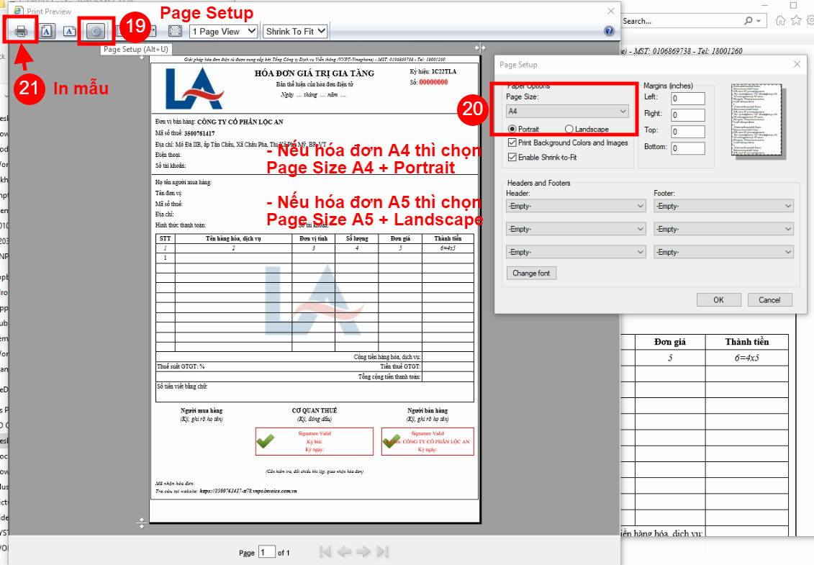

# Hướng dẫn up mẫu HDDT TT78

## Chuẩn bị

* Đăng nhập mail nhóm HDDT: ([https://mail.google.com/](https://mail.google.com))

hotrohddtvtu@gmail.com

Hddt123456aA@

* Đăng nhập trang Quản trị Dịch vụ HDDT: ([https://quantridichvu-hddt.vnpt-invoice.com.vn/](https://quantridichvu-hddt.vnpt-invoice.com.vn))

hoangmh.vtu1

hoangmh.vtu1@esVLHW

* Sheet Danh sách KH nâng cấp lên TT78: ([https://docs.google.com/spreadsheets/d/1T3gGiynyB4IT0b--iMIBI1pWVeDlTmAb9eB2Slmor3E/edit#gid=1316341386](https://docs.google.com/spreadsheets/d/1T3gGiynyB4IT0b--iMIBI1pWVeDlTmAb9eB2Slmor3E/edit#gid=1316341386))
* Nhóm thực hiện:

| Nhóm | Người phụ trách |
| ---- | --------------- |
| A    | Khoa            |
| B    | Đức             |
| C    | Hoàng           |
| D    | Sơn             |
| E    | A. Tâm          |
|      |                 |

## Các bước thực hiện

### <mark style="color:yellow;">I. Tải mẫu Hóa đơn từ mail</mark>

Mở sheet **Lịch hoàn thành**, chọn công ty có dòng **màu trắng** (chưa có người làm)


_Theo thứ tự từ dưới lên (trên cùng là yêu cầu mới nhất nên thực hiện sau)_


.png>)

\[1] Đưa chuột vào cột MST \[Cột B], click vào link để mở ra trang Gmail tìm MST (cần đăng nhập trước gmail bằng tài khoản của nhóm hỗ trợ hddt)

.png>)

\[2] Vào các mail tìm được, kiểm tra file đính kèm xem có mẫu ko. Mẫu là file .zip có tên kết thúc bằng <mark style="color:yellow;">**\<MST>\_TT78**</mark>


<mark style="color:yellow;">Nếu không tìm thấy file mẫu thì bỏ qua, chuyển qua thực hiện công ty khác.</mark>


.png>)

\[3] Tải về máy và giải nén ra các file .xml + xslt, đặt folder giống tên file .zip (sau này sẽ gửi toàn bộ các file mẫu cho nhóm hỗ trợ để backup 1 lần)

.png>)

\[4] Click vào link trong **Tên Công ty** để chuyển sang đúng dòng chi tiết của công ty đó trong các sheet huyện

.png>)

\[5] Chỉnh trạng thái công ty đã chọn thành <mark style="color:yellow;">**Đang làm**</mark> để tránh trùng lặp công việc, chú ý chỉnh đúng cột mà nhóm mình phụ trách (A, B, C..)

.png>)

\[6] Click vào link trong cột **MST** (cột M sheet Huyện) để vào trang Quản trị Dịch vụ của HDDT (QTDV)

### <mark style="color:yellow;">II. Upload Hóa đơn vào QTDV</mark>

Sau khi click link MST ở sheet sẽ mở ra trang QTDV hiển thị danh sách công ty có MST đã chọn

.png>)

\[7] Click icon **Mẫu hóa đơn** của công ty có khu vực là: <mark style="color:yellow;">**Khu vực 2 -- Thông tư 78**</mark>


### **LƯU Ý**

Ở bước này, nếu chỉ thấy 1 dòng công ty nhưng khu vực <mark style="color:yellow;">không phải</mark> **Khu vực 2 -- Thông tư 78** mà chỉ là <mark style="color:yellow;">**Khu vực 2**</mark> thì báo lại nhóm hỗ trợ để cấu hình cho đúng rồi mới thực hiện tiếp.


.png>)

.png>)


File Schema: Trong bộ file mẫu (.zip) nếu không có sẵn file schema.xsd thì upload file scheme dùng chung.&#x20;

Link tải file schema dùng chung: [schema.xsd](https://drive.google.com/file/d/1cn-nj9kJepn0MLeurls7xN2CH9bLlVLA/view?usp=sharing)


.png>)

.png>)

\[9] \[10] \[11] Tổng hợp các trường cần sửa:

* Tên mẫu: <mark style="color:yellow;">78ma1</mark>
* Invoice View: <mark style="color:yellow;">HAIINVVATTT78</mark>
* Upload mẫu (3 file)
* Loại hóa đơn: Tùy theo mẫu đã upload, thường chỉ có 2 loại Hóa đơn GTGT hoặc Hóa đơn Bán hàng

.png>)

Sau khi click **Thêm mới** sẽ trở lại trang danh sách các mẫu đăng ký. Kiểm tra lại có mẫu tên bắt đầu bằng `78ma1_` là up mẫu thành công.

### <mark style="color:yellow;">III. Gửi mail báo cho AM</mark>

\[13] Trở lại sheet Danh sách KH, chỉnh cột trạng thái Hoàn thành

.png>)

\[14] Sau khi chỉnh trạng thái **Hoàn thành** thì cột **Email** (cột T) mới hiện nội dung mail gửi để Copy.

.png>)

\[15] Paste nội dung đã copy từ cột **Email** bên sheet vào

\[16] Mở mục CC. Do đã gán sẵn Nhóm liên hệ là **CC HDDT** nên chỉ cần gõ "cc" và chọn nhóm **CC HDDT** là được


Danh sách đầy đủ cần CC: _hotrohddtvtu@gmail.com, khanhmaivt@gmail.com, ngavtt.vtu79@gmail.com, nvdung08121977@gmail.com, loane10vt@yahoo.com.vn, loanptk.vtu@vnpt.vn, taytt.vtu@vnpt.vn_


.png>)

\[17] **** Vào folder file mẫu, mở file đuôi .xml bằng **Internet Explorer.**

\[18] Right click chọn **Print Preview**

\[19] \[20] Vào **Page Setup** để cấu hình PDF trước khi in:

* Nếu mẫu hóa đơn dạng A4 nằm dọc thì chỉnh Page Size A4 - Portrait
* Nếu mẫu hóa đơn dạng A5 nhỏ, nằm ngang thì chỉnh Page Size A5 - Landscape

.png>)

\[22] Chọn máy in **Microsoft Print to PDF** và nhấn **Print**. Lưu file PDF vào folder mẫu

.png>)

\[23] Đính kèm file PDF vừa in vào mail đang soạn và **Gửi**
